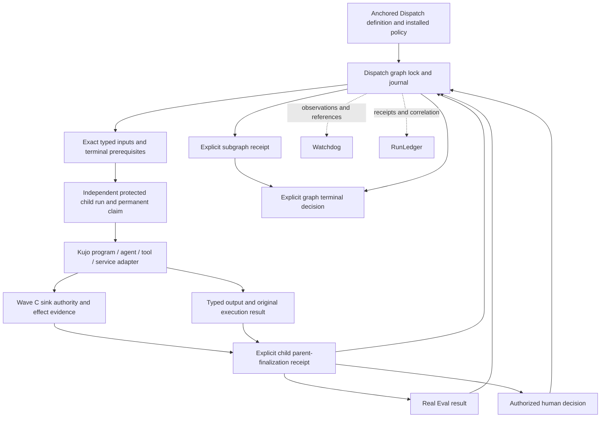

# Wave F execution audit — 2026-10-07

## Decision and scope

Wave F is a protected, static, serial, trusted-host composition protocol in
Dispatch. It is not a general scheduler or a production-ready graph platform.
Kujo 1.8.0 is released; that does not stabilize ecosystem alpha/beta contracts.
This audit starts from fetched main, not historical implementation worktrees.
Source inspection and historical evidence are distinguished from this session's
executed verification in the [companion evidence report](WAVE_F_EXECUTION_EVIDENCE_2026_10.md).

The smallest candidate correction is **subgraph-local settlement checks**:
`scoped_outcome_facts` filters node facts by group membership but checks held
program/Eval reservations and unresolved Eval dispatches globally. A completed
independent group can therefore become blocked by unrelated work. Reproduce this
before implementation. Keep graph-wide settlement strict. No dynamic topology,
new cancellation authority, distributed orchestration or runtime change is justified
by that correction.

The companion evidence report records the completed correction and verification.
The baseline gaps and pre-implementation criteria below retain their original
scope; the selected settlement gap is now closed by Dispatch `93b747a`.

The roadmap's operator stop condition is real: do not infer permission for another
architecture expansion from an older tranche's “next phase.” The present user
explicitly requested renewed investigation. Correcting an existing lifecycle
boundary is narrower than implementing a new architecture phase.

## Source baseline and ownership

| Repository / fetched main | Owned boundary and inspected anchors |
| --- | --- |
| kujo `0d22cc0` | Language/VM, capabilities, file locks, exclusive atomic writes, directory sync, process execution, measurements. `ROADMAP.md`, linked Wave F/parent/recovery records, `docs/NEXT_PHASE_ARCHITECTURE.md`. No graph scheduler belongs here. |
| dispatch `e1bbc21` | Definition, readiness, policy, installed authority, admission, attempts, reservations, journal, reconciliation and terminal decisions. `src/core/{runner,node_composition,node_execution,node_transition,graph_transition,graph_policy,graph_policy_operation,graph_outcome,graph_attempts,resource_ledger,resource_operation,retained_recovery,parent_finalization}.kujo`. |
| workcell `0f9595b` | Workspace/provider lifecycle, retained Git/workspace observation, preservation and execution/effect evidence. `src/evidence/{execution_result,preservation,retained_workspace,git_effect}.kujo`; storage is owner evidence, not replay permission. |
| runledger `334ddd4` | Receipt aggregation, nullable usage/cost, Dispatch/Eval/Watchdog correlation, verified artifact notes. `src/{record,cli}.kujo`, `tests/runtime_measurement_reference.cjs`. Local main was fast-forwarded from `97cb607`. |
| watchdog `a842217` | Telemetry, execution observations and measurement attachment; `src/runtime_measurements_adapter.kujo`, native event schema. Existing local config edit preserved; not authoritative graph state. |
| eval `6a5ab09` | Real evaluation facts with exact subject, configuration digest and evidence IDs; `src/control_contracts.kujo`. Dispatch decides policy and terminal state. |
| ability `bcbecb4` | Effect declarations, validated invocations/receipts, installed handlers, application authorization/idempotency and assurance profiles; `src/{contract,contracts,runtime}.kujo`. |
| agents-sdk `978354a` | Agent/tool implementation, context ledger and usage, Watchdog adapters. Inspected fetched main in a detached audit worktree because the primary checkout contains unrelated maintenance files. Participant SDK prototypes live in Dispatch and are a different product. |
| spec `1211f37` | Task/check contracts (`src/validate.kujo`); no graph admission or lifecycle authority. |
| mcp `83e4d62` | Controlled Ability transport and correlation, not admission policy or replay authority. `integrations/kujo-ability/bin/controlled-ability.mjs`, `examples/controlled-ability/`, `src/telemetry/watchdog.kujo`. |

Additional existing seams: Dispatch's TypeScript/Python/Go interop participants,
SQLite sink adapter, Workcell Git and Ability application sink profiles; Scent/RAG
are potential context artifact producers, CaseFile preserves failure evidence,
Leash transports intervention. None can manufacture Dispatch terminal authority.
No live provider, remote service or hidden model reasoning is needed for this audit.

## What exists and what the tests establish

All graph features below remain experimental, opt-in and local. Test names are
source evidence; consult the final evidence report for fresh execution results.

| Capability | Actual implementation / proof anchor | Limit |
| --- | --- | --- |
| Static topology and identity | `validate_composed_definition`, immutable assurance anchor, workflow SHA-256; `node_contract_tests`, `node_composition_policy` | 1–8 nodes, `max_parallel_steps == 1`, no graph mutation API; run identity is declared, not a globally content-addressed run ID. Event IDs include time. |
| Producer/consumer, fan-out, joins | `prepare`, `ancestors`, `advance_composed_step`; `node_composition_integration`, `node_composition_recovery` | Serial traversal of declared edges, not parallel execution; data edges must refer to ancestors. |
| Typed artifact provenance | `output`, `validate_node_binding_bytes`, `read_bound_node_input`; node policy and attempt binding safety tests | JSON/schema family; up to 8 inputs/outputs, 1 MiB content, bounded 4 MiB deduplicated binding. Exact subject, original result, parent receipt/revision, schema, metadata and content digests. |
| Protected executable nodes | `run_bound_node`, `validate_bound_node_inputs`; node recovery tests | Independent child lock, one-use retained claim; input/dependency satisfaction never grants effect authority. |
| Human and Eval terminals | `local_facts`, `graph_terminal_operation`; heterogeneous integration/policy/recovery | Real intervention v2 authorization/revision or evaluation-result/v1; no fake execution result. |
| Required/optional outcomes | `scoped_outcome_facts`; heterogeneous policy/recovery | Optional failure does not satisfy success dependency. Unfinished dispatched optional execution blocks graph sealing. |
| Branches and conditional joins | `path_state`, `policy_dependencies`, `policy_controls`; static policy integration/edges/recovery | At most 2 branches, 2–4 cases, unconditional sources. Inactive means `not_selected`, not success/cancellation. |
| Subgraphs | `policy_group`, group assess/apply, `policy_ready`; static subgraph/recovery tests | At most 2 disjoint one-level unconditional groups; explicit entry/required-success receipt and output references. No independent child graph run, nested group, local budget ceiling or branch-containing group. |
| Failure strategy | `failure_strategy`; static subgraph/policy tests | fail, block, optional continuation, declared route, new review, constrained retry. Failure facts are preserved. |
| Program accounting/retry | `fold_attempt`, `assess_attempt`; graph attempt contract/integration/authority/recovery/binding safety | Held/consumed/released ledger. At most 2 declared child runs; retry only after sealed pre-admission resource refusal. No post-admission retry from silence. |
| Eval budgets/retry | `fold_resource`, `claim_evaluation`, resource operations; resource integration/policy/recovery/limits | Distinct capacity, one-use claim; second invocation only after conclusive infrastructure failure, not quality rejection or unknown completion. |
| Resource measurements | `resource_facts`, `resource_readings`, `resource_guard`; resource tests | Observed process metrics and provider-reported usage distinguished from estimates/unknown. No hard token/time/currency ceiling. Required usage may block admission. |
| Parent finalization / `$ref` | `parent_finalization`, preservation binding; parent integration and portable vectors | Effects, outputs, Eval, preservation and explicit decision remain separate. Exact-byte Workcell document binding preserves historical codec bytes. |
| Recovery | `retained_recovery`, projection functions; retained/node/heterogeneous/static/attempt/resource recovery tests | Surviving checkpoint and exact journal/evidence only; explicit plan/apply, no execution. Missing state, torn/conflicting records or unknown work fails closed. |
| Installed operator | `src/operator/`, `tests/operator_rehearsal.mjs` | One batch-summary host; not a general public graph authoring SDK. |

## Persistent state and transitions

Dispatch's `state.json` is a revisioned projection using the protected storage codec;
SQLite catalog/index support does not replace control authority. Each run retains
`control-records/<sequence>.json`, a hash-linked `control-events.jsonl` index,
exact `node-input/<sha256>.raw` artifacts, permanent node claims, Eval claims under
`eval-admissions/`, effect lifecycle artifacts/claims, parent finalization bytes,
review checkpoints and reconciliation receipts. The journal bounds are 1 MiB/event
and 8 MiB/active journal; retained inventory is bounded. There is no unbounded
archive/replay service. Installed policy/adapter source revisions are additional
live admission prerequisites; persisted participant data cannot supply callbacks.

Writes retain evidence, publish an exclusive immutable control record, sync its
directory, append the index and publish the checkpoint. These are separate failure
boundaries, not one cross-file or cross-sink transaction. Existing advisory locks
hold their inode and are released by process death; lock age is not authority.
A crash may leave an orphan record or permanent claim without a checkpoint.
Recovery reconstructs supported exact transitions, never missing actions.

| Subject | Transition path and authority |
| --- | --- |
| Program | declared pending → held reservation (opt-in) → exact inputs bound → durable dispatch consumed → exclusive child claim → admitted → execution/effect facts → explicit parent terminal → graph terminal observation |
| Program refusal | binding → preflight refusal before claim → sealed old child → explicit retry reservation for distinct declared child; old fact and consumed graph unit remain |
| Reservation | held → consumed dispatch OR explicit released before dispatch/claim/result/refusal; released reservation remains historical |
| Eval | exact input binding → held → consumed dispatch → worker claim → retained response/resolution → policy-mapped node terminal; infrastructure retry gets a new identity |
| Human | exact binding → revision-bound review request → installed-policy-authorized approve, abort or cancel → real node terminal |
| Branch | exact source terminal → separate locked activation; immutable chosen path |
| Subgraph | explicit entry and member facts → assessed outcome → separate authorized locked receipt; internal completion alone cannot open downstream group barrier |
| Graph | running/paused → informational candidate → authorized revalidation under lock → completed/failed/cancelled receipt; node readiness alone cannot seal it |
| Repair | inspect → exact source-bound plan → authorized locked apply → journal/projection repair → separate future continuation decision |

The graph-native event inventory is closed by `graph_event`, `apply_node_transition` and their
projection validators; legacy runner statuses are not substitutes for these facts:

| Immutable event(s) | Projection consequence |
| --- | --- |
| `node_inputs_bound`, `node_execution_refused`, `node_execution_admitted` | Bind a pending child once; refusal and admission exclude each other. Refusal pauses the child. |
| `node_start_requested`, `node_terminal_observed` | Record one dispatch and one observed terminal for the current declared child. A pending/paused graph node becomes `completed`, `failed`, `rejected` or `cancelled` only with matching terminal authority. |
| `graph_attempt_reserved`, `graph_reservation_released`, `graph_attempt_retried` | Append reservation history; release only an unconsumed row. Safe retry selects a distinct declared child, resets the logical node's current projection to pending and removes only its current dispatch/completion projection. Historical rows/events remain. |
| `graph_resources_reserved` | Atomically publish the bounded reservation plan in the graph journal; fold program reservations and exact Eval bindings/rows under the graph lock. This is not atomic with a participant's effects. |
| `graph_eval_released`, `graph_eval_dispatched`, `graph_eval_resolved` | Held → released or consumed → resolved. Resolution is `completed` or `infrastructure_failed`; `completed` delivery is separate from the Eval verdict. No transition from unknown consumption to refunded capacity. |
| `graph_resource_observed` | Append exact sourced measurement evidence without inventing execution or completing the graph. |
| `graph_node_bound`, `graph_review_requested` | Bind graph-local terminal inputs once; retain a revision-bound request. These operations pause the graph, not complete the node. |
| `graph_branch_activated`, `graph_subgraph_finalized` | Retain one selected path or group receipt; neither executes a child. |
| `graph_finalized` | Set graph `completed`, `failed` or `cancelled` from a current authorized candidate; later graph transitions and node dispatch/terminal events are rejected. |

Before graph finalization, validated heterogeneous graph projections permit
`running`, `paused`, `interrupted` or `needs_changes`. `blocked` is an assessment,
and `not_selected` is derived branch membership, not a manufactured success or
cancellation terminal. A bare persisted terminal status without its matching
journal fact is invalid. Parent/effect state machines remain independently owned
by the existing finalization and Wave C lifecycle contracts.

`cancel_requested` on a heterogeneous runner causes a pause requiring a graph
decision. `optional-cancel` is limited to an unadmitted, undispatched optional
legacy program contract and requires reservation release first. Required human
cancel can supply a cancellation outcome; human rejection is a distinct failed
policy input. Neither is a durable graph-wide stop request with descendant
acknowledgements. Required failure can still allow unrelated ready work according
to declared policy. Exhaustion blocks new admission, not already-consumed work's
truthful settlement. No process preemption or rollback follows from graph status.

## Failure and recovery matrix

“Read” below is safe automatic inspection. Repair/admission/finalization are
explicit operations with revalidation, not automatic recovery side effects.

| Crash/failure point | Durable known facts | Uncertain facts | Safe next action | Prohibited action | Review needed |
| --- | --- | --- | --- | --- | --- |
| Before node admission | Definition, possible binding/reservation/dispatch | Delivery/execution absent unless proven | Read; explicitly release only never-dispatched reservation | Treat binding/budget as admission; refund dispatched unit | Yes if dispatch exists |
| After admission / before execution | Permanent claim, possibly admission event | Whether work started | Retain claim, inspect independent evidence | Clear claim or repeat invocation | Yes |
| During execution | Claim and committed prior records | Current process/effect completion | Observe original invocation/sink | Restart unknown work automatically | Yes |
| After effect / before result persistence | Sink may have mutation; admission consumed | Missing result and outcome | Independent installed sink verifier | Replay because response is missing; invent execution result | Yes |
| After result persistence / before dependent admission | Exact result plus any actual parent/node receipts | Missing final decisions | Revalidate/finalize then separately admit dependency | Output existence implies parent success | Explicit decision |
| Partial fan-out | Per-child dispatch/binding/claim history | Undelivered or unfinished sibling | Continue only independently eligible undispatched work | Redeliver consumed work or declare siblings complete | For uncertain child |
| Partial join | Exact available inputs and terminals | Missing predecessor facts | Remain blocked; activate declared case separately | Omit required input; infer inactive branch | If facts unavailable |
| Subgraph finalization | Members or actual immutable group event | Missing group decision/index | Explicit finalize; repair exact orphan event | Invent receipt from members or release effects | Explicit decision/repair |
| Eval | Consumed unit and claim; possibly exact retained response | Completion if no response | Read back exact response; otherwise block | Refund, rerun from silence, treat fail verdict as infrastructure retry | Yes if uncertain |
| Waiting for human | Exact request, binding and revision | Human intent without accepted decision | Reissue current review through authorized path | Fabricate approval or reuse stale decision | Yes, real human |
| Cancellation | Existing terminals/claims; optional or human cancellation record if committed | General descendant stop/ack not represented | Preserve completed/unknown effects; inspect and block unsafe work | Claim graph-wide cancellation propagation or rollback | Yes |
| Budget exhaustion | Journal-derived held/consumed units | Unknown usage remains unknown | Resolve consumed work; release provably never-dispatched held units | Raise anchored ceiling, zero unknown usage, refund silence | Explicit release/review |
| Parent finalization | Prerequisite bytes or actual terminal event | Decision absent unless recorded | Explicit finalize or reconstruct exact terminal event | Effects complete implies parent complete | Explicit decision/repair |

Also reject corrupt artifacts, unsupported controller features/schema versions,
stale candidates, changed authority and missing permanent claims. Fresh-process
SIGKILL tests exist at immutable publication/index, dispatch/admission, sink mutation,
Eval reply and terminal boundaries. This is process-crash evidence, not proof of
power-loss durability on every filesystem or machine-loss reconstruction.

## Provenance and observability

The reconstructible chain is graph run/workflow digest → logical node → declared
child run or Eval attempt / human decision instance → exact input binding →
installed authority/profile/configuration → original result/effect attempt → typed
output → Eval/human receipt → node/group/graph terminal event. Attempts in the
child action/effect protocols are not interchangeable with logical node ordinals.
Stable correlation requires retaining these separate IDs, not replacing all with
one trace ID. Content-addressed artifacts provide integrity, not proof of honesty.

Watchdog's existing native execution observation can carry runtime artifact
identity and trace/span correlation. RunLedger already records Dispatch/Eval/
Watchdog IDs and exact measurement references in notes, while nullable usage/cost
stays nullable. Neither contains a complete authoritative graph replay projector.
Dispatch's journals and installed host remain necessary. Prefer a future read-only
export joining these existing identifiers over a new telemetry system. Never infer
control authority from receipt status or telemetry arrival order. Scent/RAG source
lineage is additional externally inspectable data, not hidden model reasoning.

## History, discrepancies and competing abstractions

Relevant Dispatch history: `e4d1726` composition, `2b69326` heterogeneous terminals,
`e8953f1` static groups/branches, `32bff57` attempts, `74800d5` retry provenance and
versioned terminal commitments, `cdc0cea` sourced resources, `e1bbc21` merged
operator rehearsal. The scope omission appears when global accounting checks were
added to the shared graph/group outcome evaluator; the original group evaluator
explicitly restricted node facts to membership.

Historical documents still say parent finalization, Eval budgets or retries are
future work. Later linked tranches supersede those statements only within their
stated bounds. `WAVE_F_STATIC_GRAPH_POLICY.md`'s “same-node retries deferred” does
not negate the later sealed-refusal retry contract. The supplied agent guide's
1.7.0 release text is stale relative to current main's 1.8.0 roadmap. Roadmap
“execution/resource budgets” must not be read as hard monetary/time/token control.

Legacy unprotected Dispatch resume deliberately has at-least-once behavior
(`tests/run_lock_concurrency_tests.sh` proves a crash can repeat a mutation).
Protected Wave F admission is a different opt-in path. Never generalize its
unknown-effect safety claim to every legacy workflow. Existing v1 behavior must
remain compatible. The graph/group outcome evaluator is intentionally shared;
its scope must not accidentally collapse group and graph lifecycle obligations.

Other apparent overlaps have different authority: workflow budget summaries versus
journaled dispatch capacity; SDK context estimates versus provider-reported usage;
Workcell execution receipt versus Eval judgment versus Dispatch terminal decision;
RunLedger status versus durable control state. Reuse each at its actual boundary.
Historical participant bytes, portable-json/v1, execution/evaluation-result/v1,
Wave C alpha/beta negotiation, one-profile-per-run and required controller feature
checks must remain intact. Generalized services still need installed adapters;
closed executable/Eval/human variants are not arbitrary participant extensibility.

## Ranked baseline gaps and bounded implementation plan

| Priority | Gap / prerequisite | Next bounded action |
| --- | --- | --- |
| P0 before any production claim | No general cancellation fence/settlement protocol; process death and unknown effects cannot be treated as cancellation acknowledgement | Design append-only stop intent, exact scope, admission fencing and independent settlement. Reuse graph/child locks; prove no lock inversion and lost-reply behavior before implementation. |
| P0 for stronger recovery claims | Unsupported active/missing-state history, trusted local storage, bounded journal and non-atomic sink/result publication | Preserve fail-closed behavior. Define archival/checkpoint authority separately; never reconstruct missing effects. |
| P1 selected candidate | Global resource settlement leaks into group outcome assessment | Reproduce independent group blockage, restrict settlement blockers to group members, retain global accounting validation and strict whole-graph sealing. |
| P1 | No true nested lifecycle or independent group ceilings | Define child graph identity, parent ownership, explicit boundary inputs/outputs and scope-local settlement before nesting. Preserve group receipt as mandatory barrier. |
| P1 | Graph stop policy distinct from required failure and review denial | Specify whether unrelated ready nodes may proceed; do not silently convert declared failure policy into fail-fast cancellation. |
| P1 | Incomplete cross-participant capability and inner-attempt attribution | Bind owner-produced authority and inner execution observations to existing attempt/effect IDs; explicitly retain missing evidence as unknown. |
| P2 | No complete read-only execution lineage export through existing observers | Compose Dispatch receipts with Watchdog/RunLedger correlation; distinguish unavailable evidence from absent events. |
| P2 | Operational qualification | User adoption, expiry/retention handling, journal archival, power-loss/platform tests, bounded latency profiling and clear unsupported recovery diagnostics. |
| P3 | Dynamic admission | Versioned immutable proposal/admission epochs with deterministic parent/proposal/ordinal identity, capability/effect validation, capacity reservation and duplicate/conflict rejection. Requires closed cancellation/settlement and recovery semantics first. |
| P3 | Distributed execution | Explicitly out of scope; no queue/leader/remote authority introduced. |

### Selected tranche completion criteria, defined before implementation

1. A fresh-process regression reproduces the unrelated-reservation/group outcome
   coupling on unchanged main. Failure must be semantic, not setup/toolchain failure.
2. A group with settled members may finalize despite an unrelated held program or
   Eval reservation or unresolved Eval dispatch. Whole-graph finalization remains
   blocked in every corresponding case.
3. Held member reservations and unresolved member dispatches still block group
   finalization, including optional members and required failure/cancellation races.
4. Source hashes, revisions, locks, actor checks, member/output evidence and immutable
   terminal publication remain unchanged. Stale/duplicate apply and crash repair
   tests continue passing. No existing fixture bytes are rewritten.
5. Existing Dispatch canonical gate runs before and after; new regressions join it.
   Kujo docs checks run. Gate limitations/failures are retained, never relabeled pass.
6. Measure group assessment before/after using the same fresh-process fixture;
   characterize cost without claiming an optimization or universal latency bound.
7. Document the internal semantic correction and remaining experimental scope;
   retain final command results, crash scenarios, compatibility evidence and commits.

If the reproducer or compatibility evidence does not support this correction,
stop implementation and publish the audit/plan with the unresolved evidence.

## Design boundaries for subsequent work (not implemented)

**Bounded dynamic admission:** the current immutable workflow digest is bound into
input, policy, authority and terminal candidates. In-place definition replacement
would invalidate historical truth. A future proposal should name a base graph
revision, parent scope, installed template digest, explicit typed input references,
declared effect/capability requirements, bounded node count and requested capacity.
Derive its identity from canonical proposal bytes plus parent admission identity
and ordinal. Admission must append an epoch referencing the old immutable topology,
not rewrite it. Under the existing graph lock, validate duplicate/conflicting
identity, acyclicity, parent openness, installed policy, capabilities and capacity
before committing an admission record. Recovery folds only admitted epochs; an
unaccepted proposal never runs. Replay must reproduce identical IDs and reject
changed proposal bytes. The missing prerequisite is a defined closure/stop boundary
that prevents late admissions after parent settlement, with feature negotiation
for topology epochs. Neither a model suggestion nor spare budget is authority.

**Nested lifecycle:** keep today's disjoint group receipts unchanged. A later
child-graph contract needs a distinct child instance and parent admission reference,
immutable membership, explicit boundary inputs/outputs and delegated capacity that
cannot be counted twice. Parent required/optional child membership must be declared
at admission. Closing the child requires its own recorded terminal decision after
settlement, then an independently validated parent observation. A child effect or
successful leaf cannot substitute for that decision. Cross-scope failure and stop
policy needs explicit mapping; do not reuse `depends_on` to mean both “starts after”
and “parent waits for child.” One-level groups do not already implement this model.

**Cancellation:** a candidate bounded next protocol would append a versioned,
authorized stop intent identifying graph/scope, exact revision and reason, then
close admission for that immutable membership. Pending unclaimed work can be
recorded as never started; held reservations may be released only through existing
proofs. Consumed work remains consumed and must settle through existing result,
Eval and effect evidence. A request is not an acknowledgement or terminal outcome.
A descendant may finish after the stop request; its completed effects stay complete.
Unknown effects leave settlement blocked and require independent evidence/review.
After controller death, restore the fence from its actual immutable event; never
invent acknowledgements. Graph/child lock order and callback revalidation must be
proven against a concurrently starting child before implementing this protocol.
The present admission callbacks read graph facts without acquiring the graph lock;
an added fence cannot be claimed race-free merely because its writer holds that lock.

**Recovery/observation:** expand supported projections only with source-bound
transition proofs. Additive report fields should expose uncertain dispatch,
missing result, retained-but-unindexed decision and missing authority separately.
Keep original artifacts available by digest, use existing RunLedger note and
Watchdog reference seams, and leave control decisions in Dispatch. A journal
export without installed authority or surviving claims must remain read-only.

**Adversarial coverage selection:** existing node policy tests cover duplicate IDs,
input corruption/provenance and unsupported topology; graph attempt authority and
binding safety cover stale authority, duplicate/retry and downstream lineage;
heterogeneous policy/recovery cover required/optional terminals, review and terminal
races; static policy edges/subgraph tests cover joins, branch selection and rejected
nested/conditional definitions; resource recovery covers last-unit contention,
duplicate worker invocation and response loss. Unsupported nested failure/cancel
and dynamic admission are rejection boundaries, not functioning capabilities.
The selected new regression adds a missing cross-scope combination to those tests;
it does not substitute for their canonical rerun.

### Observer storage and fresh compatibility finding

RunLedger `src/storage.kujo` uses per-record locks and atomic receipt files; its
notes are reporting extensions. Watchdog `src/watchdog_shared.kujo` and
`src/dashboard_server.kujo` use SQLite telemetry tables/store identity. These
stores are independently persistent, not a transaction participant in Dispatch
admission. Eval writes reports/evaluation-result evidence; Workcell retains
workspace/Git and preservation artifacts. Loss of an observer store does not
justify re-executing a Dispatch action, and a surviving observer record cannot
repair missing Dispatch authority.

Fresh verification found a Watchdog **test compatibility defect** at
`tests/runtime_measurements_adapter_check.js:52`: it treats every counter emitted
by the runtime as mandatory when generating deletion negatives. The v1 schema's
required list and Watchdog `measurement_keys()` exclude the additive
`bytecode_compile_wall_ns` counter. With the checksum-verified released Kujo 1.8.0,
the test fails at `missing-counter-bytecode_compile_wall_ns`; with its documented
1.6.0 runtime the 76-case integration proof passes. The adapter intentionally
accepts additional numeric counters and accepts their absence. This is an open
verification-maintenance item, not evidence of a graph admission defect. Fix the
test against the normative required set while retaining explicit optional-counter
acceptance and privacy negatives; do not make optional fields mandatory to satisfy
the test. This session does not alter Watchdog or its existing local config edit.

### Authority provenance completeness

The current chain identifies the result producer, installed host/profile/configuration,
review actor and effect verifier. It does **not** provide one universal per-attempt
snapshot of the actual Kujo process capability mask, arbitrary service credentials
or every external participant permission. `execution-result/v1` names producer,
subject, effects and evidence; graph input/terminal bindings retain authority
references rather than defining such a snapshot. Workcell's producer conservatively
marks network-enabled external effects unknown. Ability separately binds principals,
definitions, policy, approvals and idempotency. These are complementary contracts.

Rank a composable authority-evidence crosswalk as P1 before claiming that the
substrate can answer “under exactly which capabilities” for every heterogeneous
participant. Bind an owner-produced bounded capability/registration observation to
an attempt and installed policy digest where available; explicitly report absent
observations. Do not infer a real human identity from a free-form actor name, a
capability grant from an artifact edge, or complete external effect enumeration
from a successful Workcell exit. Remote authentication and arbitrary participant
attestation remain unimplemented.

A concrete cancellation prerequisite is separating *new admission* from *truthful
settlement* in authority checks. `validate_bound_node_inputs` is documented as
used before initial/effect admission and finalization, and rejects an active child
when the graph has `cancel_requested`. Simply persisting that flag as a stop fence
would also obstruct existing finalization paths for already-consumed work. A new
stop protocol must retain identity/evidence validation for settlement while denying
new execution; do not implement cancellation by weakening all authority checks or
by rewriting completed child states. This source-level coupling is why a general
cancellation tranche is not selected here.

The direct installed Wave F host imports Workcell workspace/preservation/retained
observation and Eval control-result builders; its effect adapters reuse Workcell
Git and local SQLite. AI SDK is an adjacent execution dependency, not graph control:
fetched main `1f4c7678506d2ce76e26e67e4697e08ceca108c2`,
`src/ai_sdk.kujo` contains bounded transport retry loops governed by `retry_budget`.
A single graph program dispatch may contain several tool/model/transport actions.
The graph program ceiling therefore does not bound all provider requests, and a
graph attempt ID is not a complete ledger of those inner attempts. Before claiming
universal action attribution, bind owner-produced inner attempt and effect evidence
to the existing child run; do not promote dispatch count to request count. The
current offline graph proof does not require a live AI provider, Scent/RAG, Leash
or a new MCP server. Those remain producer/transport seams, not hidden schedulers.
The primary AI SDK checkout remains at `71bad146`; its `src/` tree is identical
to fetched main. It was not advanced while canonical tests were using it.

The canonical MCP compatibility fixtures use the primary checkout at
`e02905d4d587a099529b4f4e1ade61060a0c7f94`. Fetched MCP main is
`83e4d62b0a04477f3208756a77671da765964753`; the controlled handoff, host example,
Ability projection and telemetry source are unchanged. The used STDIO bridge's
only difference is its advertised server version, 1.2.0 → 1.3.0. Current main's
other runtime/generator changes are outside that fixture's control path. A detached
current-main checkout supports separate fresh verification without changing the
dependencies of running gates. The handoff retains RPC/request/invocation/session,
Ability/receipt and Dispatch run/step/attempt/effect IDs; observer failure cannot
change admission authority. General MCP service generation is not graph scheduling.

Independent work advanced Workcell to `a276a92c6bac9279a8cb36ace9687ade34d5128f`
and Watchdog to `8c512624782878cc607794add7b71f46781a45bf` during verification.
These are not commits authored by this tranche. Workcell's changes preserve native
process cancellation in Docker results and update provider dependencies;
`src/evidence/` and `src/workspace/` are byte-identical to the audit baseline.
Watchdog's change isolates canonical batch transactions by connection; its runtime
measurement adapter and corresponding test are unchanged. The installed operator
continued using its explicit Workcell/Eval pins. These owner improvements do not
introduce graph cancellation propagation or turn observer state into control
authority. Initial audit pins and final observed heads are both retained.
